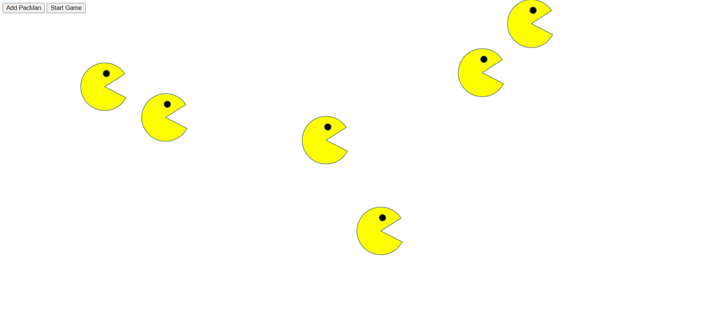

# PacMen-Exercise
## Exercise on creating unlimited bouncing pacmen

In this exercise, I created two buttons, one that allows you to add individual PacMen to the page and one that "starts the game" (aka makes them bounce around the page). The PacMen bounce off of the walls so that they always stay in view. The user can add as many PacMen as the like.

<h3>Future Improvements</h3>

The next planned step in this project is to make the PacMan image change direction as the PacMan bounces off a wall. Currently, the image always stays the same direction.

